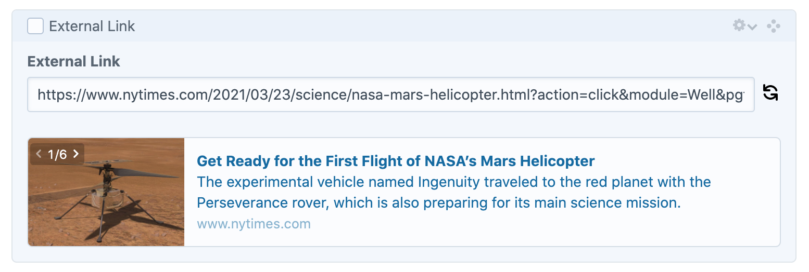

# Prismatic Links for Craft CMS

Prismatic Links brings app-like link previews to your entries.



## Requirements

This plugin requires Craft CMS 3.0.0 or later.

## Installation

You can install this plugin from the Plugin Store or with Composer.

**Note: The license fee for this plugin is $15.00 via the Craft Plugin Store. Supporting this plugin funds future development.**

#### From the Plugin Store

Go to the Plugin Store in your project’s Control Panel and search for “Prismatic Links”. Then click on the “Install” button in its modal window.

#### With Composer

Open your terminal and run the following commands:

```bash
# go to the project directory
cd /path/to/my-project

# tell Composer to load the plugin
composer require prismaticbytes/prismatic-links

# tell Craft to install the plugin
./craft install/plugin prismatic-links
```

## Usage

### CMS field

Create your field as you would any other field.

Usage:
- Insert a link and the preview will load automatically
- The image selector allows you to cycle between all images found on the destination URL 
- The refresh button will re-fetch the page


### Templates
Use our template or bring your own
```twig

    
        
    

```

```twig

    <a class="prismaticlinks-container" href="{{ myField.url }}" target="_blank">
        <div class="prismaticlinks-image">
            
        </div>
        <div class="prismaticlinks-meta">
            <div class="prismaticlinks-title">
                {{ myField.title ?? "" }}
            </div>
            <div class="prismaticlinks-description">
                {{ myField.description ?? "" }}
            </div>
            <div class="prismaticlinks-domain">
                {{ myField.domain ?? "" }}
            </div>
        </div>
    </a>

```

#### Available variables

```bash
myField.valid         # the URL was fetched successfully
myField.url           # the URL
myField.image_cached  # the locally cached version of the image 
myField.image         # the original image URL
myField.images        # an array of available images from the original URL
myField.title         # the og: or meta title
myField.description   # the og: or meta description
myField.domain        # the domain
```

### CSS

Use our CSS or bring your own

```twig

```

➡️ [PrismaticLinksField.css](https://github.com/prismaticbytes/prismatic-links/blob/main/src/assetbundles/prismaticlinks/dist/css/PrismaticLinksField.css)

### Cache

Images are cached indefinitely to avoid missing images if the destination page removes the image from their servers.

The images are stored in Craft's `storage` path as `storage/prismaticlinks`.

Be sure to take this into account in your deployment strategy if you want to ensure these files are not deleted.

### Runtime template method

This method will fetch the data and render the template HTML at runtime.

⚠️ Do not use this method in your main templates eg. home page. Execution of remote calls to external sites will cause slow page loads and potentially hang or cause timeouts on your site.

✅ Create a template fragment to be loaded via AJAX eg. `entries/url-preview/{entry_id}` and use javascript to load the template async  eg. `$.load("entries/url-preview/12345")`

```twig
{{ craft.prismaticLinks.fetch(url, template, cacheDuration)|raw }}

url            # the URL to fetch
template       # the template to render
cacheDuration  # the duration of the cache in seconds
                 null: the cache default will be used
                 0: infinity
                 -1: disabled
```


```twig 
{{ craft.prismaticLinks.fetch('https://www.github.com')|raw }}
{{ craft.prismaticLinks.fetch('https://www.nytimes.com', 'test-template')|raw }}
{{ craft.prismaticLinks.fetch('https://www.nytimes.com', 'test-template', 0)|raw }}
```

---------------

Brought to you by [Prismatic Bytes](https://prismaticbytes.com)
